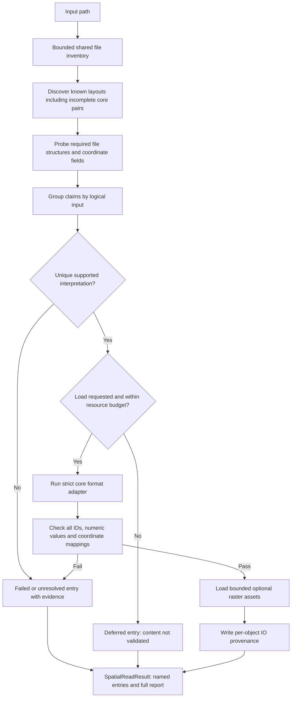

# Automatic spatial reading without score thresholds

`st.io.read_spatial(path)` is the new, additive contract-based spatial input API.
It does not call the legacy score ranker and has no `min_confidence` or `strict`
argument. Existing `read_auto_spatial`, `read_spatial_auto`, detector APIs and
platform readers retain their original behavior and return types.

For the detailed Chinese implementation report, see
[自动空间数据读取：完整说明](automatic_spatial_reading_zh.md).

## Quick start

```python
import spateo as st

result = st.io.read_spatial("/path/to/Visium/outs")
print(result.status)
adata = result.adata  # Only when exactly one complete, ready input exists.
result.write_report("spatial_io_report.json")  # Explicit output; reading does not write files.
```

A normal single Visium directory requires no additional arguments. Input files
are never repaired, overwritten, cached or combined across samples implicitly.
A path may name a supported core file, dataset root, sample parent, or bounded
container of samples. Symlinks below the resolved input root are not followed.

## Actual control flow



Discovery and structural probes do not establish that every row is valid. An
entry becomes `ready` only after full core loading and validation. In particular,
empty H5/CSV files with convincing filenames do not pass, observations are joined
by identifiers rather than row order, and invalid values are not zero-filled.
Distinct bin sizes, cell segmentation, raw/filtered matrices and sample/file
groups remain distinct inputs. Two companion encodings of the same matrix are
not assumed equivalent: unresolved alternatives remain visible.

## Supported core contracts

| Format | Supported core input |
|---|---|
| Visium | 10x v3 H5 or MEX; full-resolution pixel positions; headered CSV, legacy six-column CSV or Parquet |
| Visium HD bin | `binned_outputs/square_NNN um` layout (without the space), filtered H5/MEX and positions; bin size from directory name |
| Visium HD cellseg | Cell H5 and supported FeatureCollection GeoJSON with cell IDs and valid Polygon/MultiPolygon geometries |
| Xenium-compatible | Cell-feature H5 plus `cells` CSV/Parquet with unique IDs and centroids |
| Atera | Compatible cell core plus explicit Atera/WTA identity in recognized experiment metadata fields |
| MERFISH | Matching `cell_by_gene` / `cell_metadata` groups, numeric expression and identified coordinates |
| seqFISH | Matching counts / cell-coordinate groups, including explicit label IDs; orientation resolved by complete ID membership |
| CosMx | Expression and metadata pairs, compound cell/FOV IDs and local pixel coordinates; optional global coordinates |
| Slide-seq | Gene-by-bead expression table, named bead coordinates |
| STARmap PLUS | Raw or processed expression and corresponding spatial tables with explicit IDs; supported TYPE declarations are parsed as schema |
| Stereo-seq/BGI | GEM, or TSV/TXT with supported molecule-table header; native integer XY bins and total counts |

`obsm['spatial']` preserves a table's supported Z column when present. Visium
coordinates remain column/row (X/Y) full-resolution pixels. Cellseg coordinates
are polygon centroids. CosMx local FOV coordinates are explicitly identified as
local; different FOVs are not silently registered. Unknown coordinate units are
recorded as undeclared, not invented.

These strict adapters live in `spateo.io.spatial.auto._contracts`. They deliberately
do **not** call permissive legacy table readers, some of which coerce invalid
values or fall back to row-order alignment. The actual adapter name is recorded
in provenance. Direct platform readers remain available for broader legacy
formats and optional analyses.

## Stable result contract

`SpatialReadResult.datasets` maps stable source/representation keys to
`SpatialDataset` entries. Each entry contains `technology`, `source`,
`representation`, `evidence`, `validation`, `diagnostics`, `estimated_bytes`,
`status`, and `adata` (only for a ready entry).

| Entry status | Meaning |
|---|---|
| `ready` | Core loaded and fully validated |
| `failed` | Required content, format, dependency or reading failed |
| `unresolved` | Several viable interpretations/encodings remain |
| `deferred` | Content loading not requested or exceeds resource budget |

Collection status is `ok` only when all entries are ready and discovery has no
errors; `partial` reports mixed outcomes; `pending` means all entries are deferred
with no scope errors; otherwise it is `failed`. Optional asset warnings do not
invalidate a complete core object. `result.report` is a fresh JSON-serializable
view, including deferred loads performed later. Diagnostics retain earlier
attempts; inspect current status/validation for the final outcome.

```python
result = st.io.read_spatial("/path/to/multiple_samples")
for key, entry in result.datasets.items():
    print(key, entry.technology, entry.representation, entry.status)
    if entry.status == "ready":
        adata = entry.adata
        # Apply downstream analysis to this explicit representation.
    else:
        print(entry.diagnostics, entry.validation)
```

`result.adata` raises if multiple entries exist or any scope error prevents a
unique complete result. It never silently takes the first object or discards
failed siblings.

## Resource bounds and inspection

```python
result = st.io.read_spatial("/path/to/dataset", load=False)
entry = next(iter(result.datasets.values()))
print(entry.validation)  # structure passed/deferred; content not_loaded
entry.load()             # Same resolved adapter; no cross-platform fallback.
```

Defaults: a 1 GiB allocation budget, 10,000 directory entries, maximum discovery
depth four, a bounded optional image inventory and 32 MiB raster budget. These
are resource limits, not matching scores. The memory budget is a conservative
allocation estimate rather than an OS-enforced RSS cap. Existing ready objects
count toward the collection's budget. Increase the budget explicitly when a
large deferred input is known to fit, e.g. `entry.load(max_memory_bytes=4*1024**3)`.
The implementation does not promise a backed reader for every format.

The fixed input's size/modification metadata are checked around loading and
before resuming a deferred load. If core inputs change, rediscover them with a
new `read_spatial` call; this check is not a cryptographic content hash.

## Optional assets and provenance

Small, single-frame PNG/JPEG/TIFF assets are loaded when requested and within
budget, prioritizing standard hires/lowres images before QC rasters. Multiframe rasters and large assets remain explicitly deferred in
`uns['spatial'][library]['asset_status']`; paths are retained in `image_files`.
Corrupt optional images/scales produce diagnostics while preserving valid core
data. Scale metadata are never fabricated. Their presence alone does not prove
image registration.

`uns['spatial']` contains images, valid supplied scale factors, coordinate/representation
metadata and supported source H5 metadata. `uns['spateo_io']` contains the actual
core adapter, technology, source, representation arguments, evidence, policy
version, resolution reason, full-core validation results, warnings and a bounded
manifest. No new `confidence` probability is generated. The manifest explicitly
states its bounded core/raster inventory scope. Inputs without AnnData appear in
the collection report, not in fabricated object metadata.

## Deliberate limitations

- This is a core-reading contract, not coverage of every historical vendor export.
  Legacy 10x H5 groups, Seq-Scope, H5AD and unsupported layouts use their existing
  direct reader; they are not silently guessed by this entry point.
- Only supported explicit Atera metadata establishes Atera in the new entry point;
  named stain filenames alone do not establish assay identity.
- Unknown or conflicting companion encodings are reported rather than resolved
  by filename order or an arbitrary score. Sample-specific directories may be
  passed directly when a collection is outside the bounded discovery scope.
- No segmentation is inferred from molecule tables. BGI native XY bins are
  explicitly bins, not cells; only total expression is read into the core matrix.
- Optional transcript tables, cell-boundary collections, FOV composites,
  pyramidal imagery and transformations are not fully ingested by these strict
  core adapters. Use the appropriate legacy platform reader for these richer
  assets. This does not change existing platform-reader behavior.
- Optional raster inventories do not imply registration; local/raw coordinates
  must not be used as globally aligned coordinates without their transforms.
- New table arrays may have different dtypes/metadata conventions from legacy
  readers. Core values and identifiers are preserved; byte-identical legacy
  AnnData objects are not promised. H5 count dtype and feature IDs are retained.

## Reproducible validation

```bash
python -m pytest -q tests/io
SPATEO_VISIUM_DATA=/path/to/V1_Adult_Mouse_Brain python -m pytest -q tests/io
make check
```

The optional real-data test checks **every** stored matrix value, observation
order and coordinate against the original 10x H5 and positions table. Ordinary
unit tests use small synthetic bundles across every supported core technology;
they are not claims of full real-world validation for every platform.

The implementation validation completed on 2026-09-20: **81 tests passed**,
`make check` passed, and full real Visium content plus H5AD round-trip checks
passed. See the [validation record](automatic_spatial_reading_validation.md).
To reproduce the independent real-data report:

```bash
python scripts/verify_automatic_spatial_reading.py /path/to/V1_Adult_Mouse_Brain --output /path/to/report
```


Cross-format validation now covers 11 categories, 550 cases and 1,650 calls, with additional local real-source checks across seven categories. See the [full benchmark report](automatic_spatial_reading_benchmark_zh.md) for rounds, denominators, retained initial failures and untested real-data categories.
