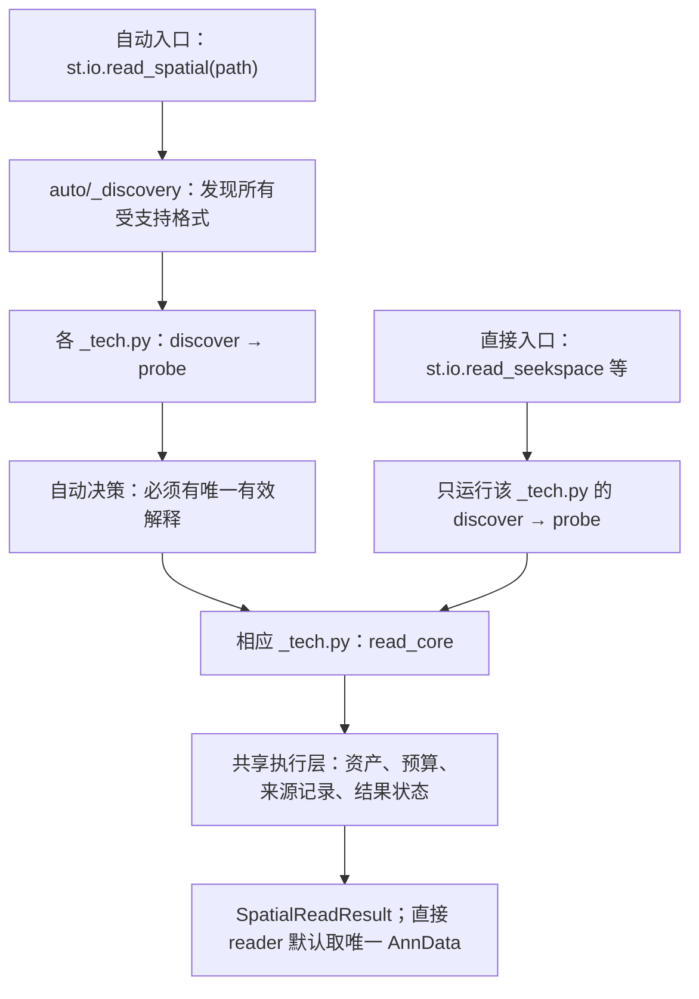

# 国产空间 reader 独立实现与自动调度

更新：2026-09-30。此次重构把四种新平台的原生 IO 放到各自的 `_tech.py`，使明确平台的直接读取不再调用自动识别入口。文件合约、返回类型、计数保留策略和 lazy 行为保持一致；不是只将原来的包装函数改名。

## 代码职责

| 技术 | 独立实现 | 公开接口 | 模块内的原生逻辑 |
|---|---|---|---|
| SeekSpace | `spateo/io/spatial/_seekspace.py` | `st.io.read_seekspace` | MEX 与 `cell_locations.tsv[.gz]` 发现；`Cell_Barcode/X/Y` 字段；同样本图像前缀 |
| BMKMANU | `spateo/io/spatial/_bmkmanu.py` | `st.io.read_bmkmanu` | MEX 与聚合 `barcodes_pos.tsv[.gz]`；拒绝未经几何转换的五列芯片索引 |
| Salus STS | `spateo/io/spatial/_salus.py` | `st.io.read_salus` | MEX 与 `spatial.txt[.gz]`；无表头 barcode、x、y |
| CeleScope space | `spateo/io/spatial/_singleron.py` | `st.io.read_singleron` | `Spatial3` H5 标记、六列位置、raw/filtered 分别保留 |

每个模块都拥有 `discover`、`metadata`、`probe`、`read_core` 和公开 `read_<tech>`。`probe` 只做受资源限制的结构检查；`read_core` 完整读取计数，并按 ID 将坐标连接到矩阵轴。平台选择权在模块自身，通用存储与结果管理不重复实现四份。



自动层通过 `spatial/_native_readers.py` 获取对应平台模块，`auto/_contracts.py` 调用该模块的 `probe` 和 `read_core`。它不会再次实现另一套国产格式读取逻辑。

直接入口通过 `_native_common.read_direct` 将**自身模块**的发现、检查、读取函数交给 `_read_engine.run_reading`。这里不调用 `read_spatial`，也不导入 `spatial.auto`。已知平台仍需要寻找该平台的矩阵/位置配对并检查完整性；这不等于再做全平台识别。同平台多个样本可返回多个结果，不默默选择第一个。

直接读取的检查范围标为 `explicit_platform`。父目录中的其他数据样目录记录为未分类信息，不推测其技术，不因它们存在而使一个唯一、有效的目标平台样本失效；结果报告及 AnnData 来源信息保留这些目录。若要确认父目录内**所有平台**是否读取完整，应使用自动入口并检查全部命名结果。自动读取仍对未识别的数据目录保留范围错误。

## 为什么保留共享工具

- `_matrix.py` 负责 MEX/H5 稀疏存储、barcode/feature 轴、数值检查和表格读取。多个平台使用相同标准容器，重复这些底层实现容易使验证规则产生分歧。
- `_native_common.py` 负责按平台提供的字段解析器执行共同检查、按 barcode 连接、保留稳定 feature ID 和完整整数计数。
- `_layout.py` 负责有限目录清单和候选描述，不决定某目录属于哪种平台。
- `_read_engine.py` 负责资源预算、重试、源文件变化检查、可选资产与 provenance；平台操作由调用方传入。
- `_read_result.py`、`_recovery.py`、`_assets.py` 负责结果容器、恢复建议与可选图像，不依赖自动检测。

因此直接与自动两条路线复用的是同一平台原生核心，且共享低层工具的依赖方向均不回到自动调度。`spatial/_domestic.py` 只保留四个公开函数的兼容导出；`auto/_domestic.py` 只兼容转发平台注册与发现。旧路径不再承载格式解析。旧 `auto/_result.py` / `_recovery.py` 也保留兼容导出。

`adata.uns['spateo_io']['reader']` 现在记录真正执行的 `spateo.io.spatial._<tech>.read_core`，便于追踪字段解释与调试。

## 两种使用方式

```python
import spateo as st

path = '/data/seekspace/sample-output'

# 不知道平台：自动识别后调用对应的独立 reader 核心。
result = st.io.read_spatial(path, load_images=False)
print(result.report)
adata_auto = result.adata  # 仅唯一、完整且成功的范围可直接取对象

# 已知平台：该平台自行发现与读取，不运行自动平台检测。
adata_direct = st.io.read_seekspace(path, load_images=False)

# 多样本或需检查错误、资源延期时，保留完整结果。
result_direct = st.io.read_seekspace(path, load_images=False, return_result=True)
print(result_direct.report)
```

四个直接接口均维持 `path, *, load_images=True, max_memory_bytes=1024**3, return_result=False`。默认返回唯一成功的 AnnData；失败、歧义或多个样本时不会生成伪对象。`return_result=True` 用于查看所有命名条目与恢复动作。直接接口不新增 `lazy` 参数；需要按需物化仍使用 `read_spatial(..., lazy=True)`。自动 lazy 最终调用的仍是独立平台模块 `read_core`。

## 怎样验证这次重构

`tests/io/test_domestic_independent.py` 使用四种原生格式的小型 fixture，预先写定期望计数、ID、坐标和图像；位置表故意与 barcode 轴倒序，gene symbol 重复而稳定 feature ID 不同。验证包含：

1. 自动与直接读取都严格等于独立期望值，检查计数、轴、坐标、可选图像、provenance 和 H5AD 往返。
2. 将自动入口、自动发现与自动解析替换成“调用即失败”的函数，直接读取仍能成功，证明不再反向依赖自动层。
3. 追踪各 `_tech.py.read_core` 的实际调用，确认两条路线使用同一平台核心，而不是两份碰巧相同的结果。
4. 递归检查平台模块及共享模块的导入依赖，防止间接导回 `spatial.auto`。
5. 错误或重复坐标 ID、缺坐标、预算延期后恢复、同平台多样本及 Singleron raw/filtered 表示保留。
6. 混合平台父目录中，直接 reader 只检查其已知平台，其他数据目录作为未分类信息保留；自动入口仍检查完整集合。

重构后的计数与平台 fixture 覆盖不代表所有商业交付版本都已验证。真实 BMKMANU 公共原生数据 GSM8816652 的独立逐条计数审计与 H5AD 往返作为另一项验证记录；不能将小型 fixture 成功率称为平台分类准确率。原生文件标准与既有基线见 [国产格式与恢复说明](domestic_spatial_io_zh.md)。

在目标 checkout 根目录运行，明确将该源码放在导入路径首位，避免环境内旧 editable 安装指向另一份 checkout：

```bash
PYTHONPATH=. python -m pytest -q tests/io/test_domestic_independent.py
PYTHONPATH=. python -m pytest -q tests/io
PYTHONPATH=. python scripts/verify_domestic_spatial_reading.py /data/native_GSM8816652 --output /output/new_validation_directory
```

## 本轮实际验证结果

- 完整 IO 回归：**237 项通过、1 项跳过**。跳过项需要另行提供真实 Visium 数据路径。
- 本轮新增独立 reader 测试：**38 项通过**。四种技术各 9 项，另有 1 项 Singleron raw/filtered 双表示检查及 1 项递归依赖架构检查。
- 真实 BMKMANU GSM8816652：50,970 observations × 54,752 features；**25,239,573 条原始矩阵记录逐条一致**，总计数 39,824,941。自动与直接读取的 `X`、`obs`、`var`、坐标与 PNG 图像全部一致，H5AD 往返通过；provenance 指向 `_bmkmanu.read_core`。
- 本机自动读取约 4.40 秒、直接读取约 3.67 秒，完整独立审计及 H5AD 往返约 19.83 秒。这些是一次实测耗时，不是性能保证，也不是四个平台的真实数据准确率。
- 本轮改动的 25 个 Python 文件编译、isort/Black 和 whitespace 检查通过。仓库整体 `make check` 的 3 个 isort 问题位于未修改文件，与本轮基线一致，未将其算作本轮通过。

`obs`/`var` 的自动与直接比较在写 H5AD **之前**进行，因为 AnnData 写盘可将原对象字符串列转换成 categorical；不能把写盘后的 dtype 改变误归因于两个 reader。

机器可读详情见 [本轮验证记录](domestic_reader_refactor_validation_20260930.json)，前一轮格式引入及数据下载信息仍保留于 [原验证记录](domestic_spatial_io_validation_20260930.json)。Skill 仓库在源码提交后重新生成全部 IO 文件签名和 API 定位，并运行 source/CLI 联合 smoke。
